# Automatické vypnutí/zapnutí Azure VM
Efektivní využívání virtuálních strojů v Microsoft Azure je podmíněno jejich správným vypínáním v případě nečinnosti nebo nepotřebnosti. Aby nebylo potřeba to dělat ručně, existuje několik možností automatizace. Jednou z nich je služba [**Azure Automation**](http://azure.microsoft.com/en-us/services/automation/). 

V tomto návodu si ukážeme, jak nakonfigurovat automatické vypínání jednoho virtuálního stroje každý den v noci a jeho automatické zapínání každý den ráno.

## Nový Automation account
Začínáme na stávajícím Azure Portále na adrese https://manage.windowsazure.com.

Prvním krokem je vytvořit nový tzv. Automation Account, do něhož následně umístíme všechny součásti potřebné pro spouštění vypínacího a zapínacího skriptu.

1. Na portále zvolte **New -> App Services -> Automation**

	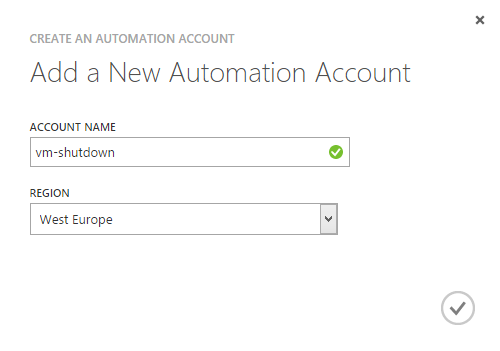

1. Zadejte libovolný název a umístění.
1. Potvrďte. Automation Account se nyní vytvoří.

## Nová identita, která bude s Automation pracovat
Abychom mohli provádět management operace s virtuálními stroji (což vypínání a zapínání je), potřebujeme identitu, jejímž jménem se bude operace vykonávat. Vytvoříme proto nový účet v Azure Active Directory a nastavíme jej jako co-administrátora subskripce.

1. Přejděte na portále do sekce **Active Directory**.
1. Zvolte directory, která náleží k vašemu Azure účtu (typicky to bude jediná, kterou uvidíte).
1. Přejděte na záložku **USERS**.
1. Dole klikněte na **ADD USER**.
1. Ponechte vybrané "New user in your organization", zadejte **uživatelské jméno** (např. *automation*) a klikněte na šipku vpravo dole.
1. Následně vyplňte alespoň **Display Name** a opět přejděte dál šipkou. Na roli v tuhle chvíli nezáleží.

	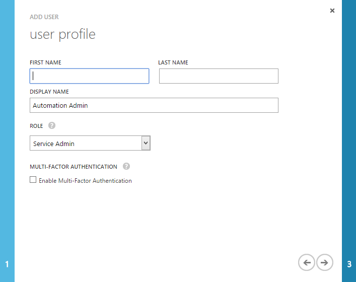

1. V dalším kroku potvrďte tlačítkem **Create**, že chcete uživateli vytvořit nové dočasné heslo, a hodnotu si poznamenejte.
	
	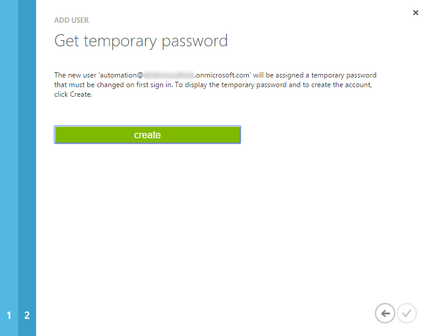

	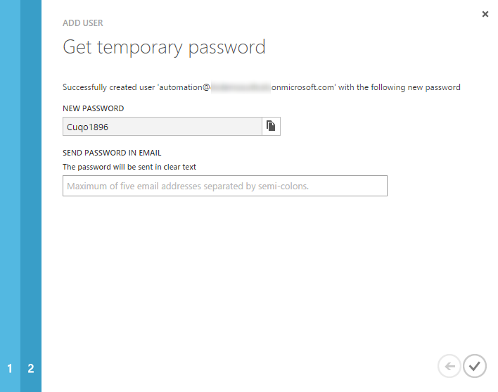
	
1. Na Azure portále přejděte do sekce **Settings** a poté na záložku **ADMINISTRATORS**.
	
	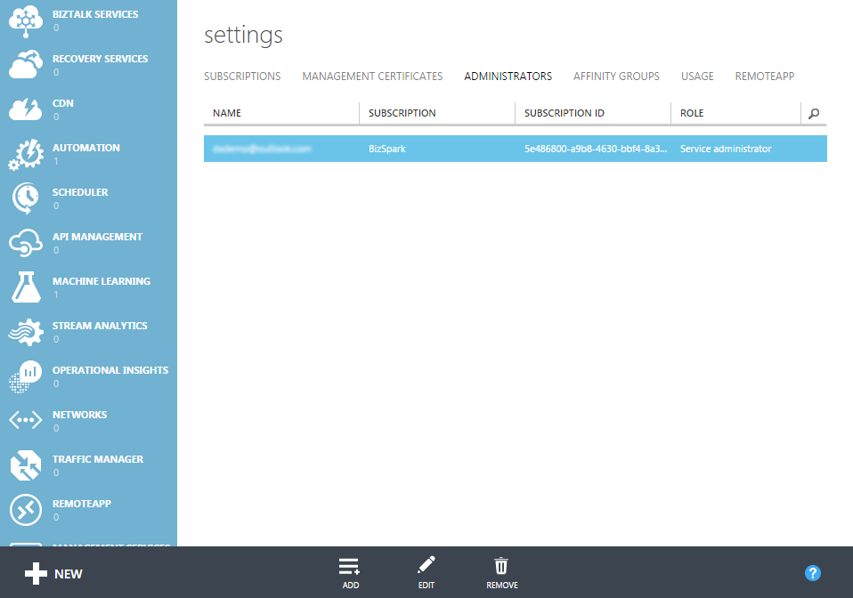
	
1. Klikněte na **ADD** a vyplňte e-mailovou adresu účtu, který byl vytvořen v předchozích krocích.

	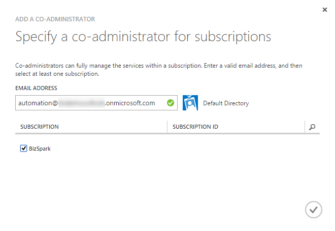
	
	* _Nyní je vhodné otevřít jiný prohlížeč (nebo novou privátní záložku) a přihlásit se do management portálu Azure jako právě vytvořený uživatel, abychom dočasné heslo změnili na trvalé a zároveň ověřili, že účet má patřičný přístup._
	
		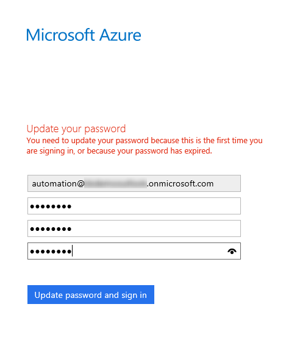
		
Právě jsme nastavili účet, který bude Automation používat, jako co-administrátora Azure subskripce.

## Příprava podpůrných prvků
1. Vrátíme se zpět na **Azure Automation** a otevřeme account vytvořený na začátku.
1. Přejdeme do záložky **ASSETS**.
	
	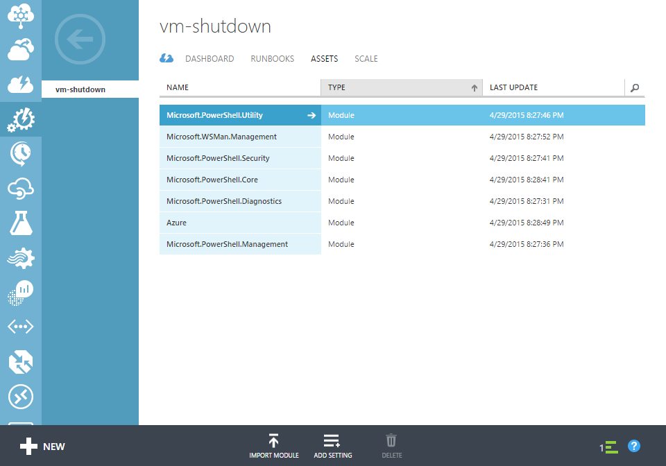
	
1. Klikneme na **ADD SETTING** a zvolíme **ADD CREDENTIAL**.
1. Zadáme **jméno**, které je libovolné a na které se budeme později odkazovat ve skriptu.
	
	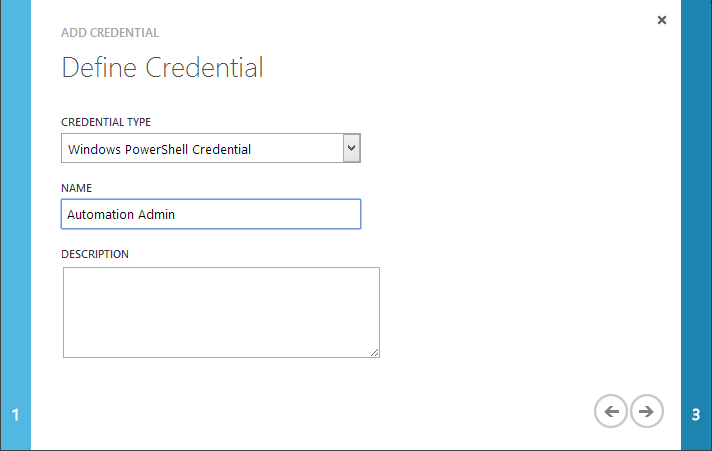
	
1.  Do pole **USER NAME** vložíme e-mailovou adresu účtu, který jsme vytvořili v předchozí části.

	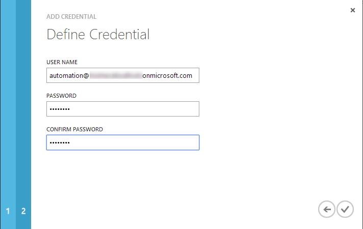
	
1. Potvrdíme.

Aby byly ovládací PowerShellové skripty co nejlépe přenositelné, vytvoříme ještě sadu proměnných, na které se v nich budeme odkazovat.

1. Opět zvolíme **ADD SETTING** a tentokrát vybereme **ADD VARIABLE**.
	
	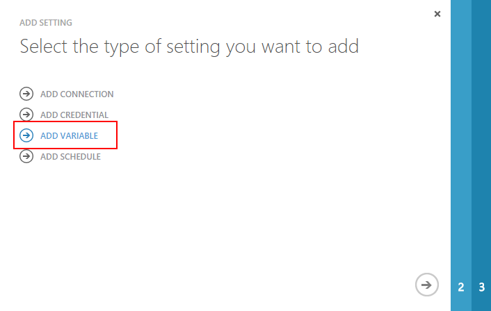
	
1. Jako typ vybereme **String** a pojmenujeme proměnnou **SubscriptionName**.

	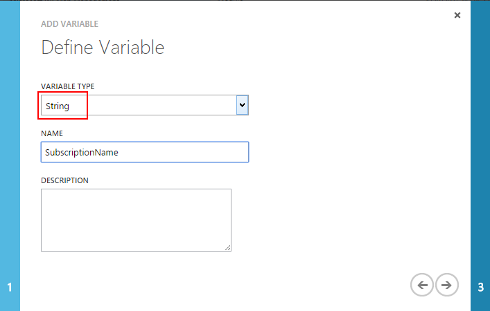

1. Na další stránce pak zadáme hodnotu (v tomto případě *BizSpark*, ale vy ji nahradíte názvem svojí subskripce.

	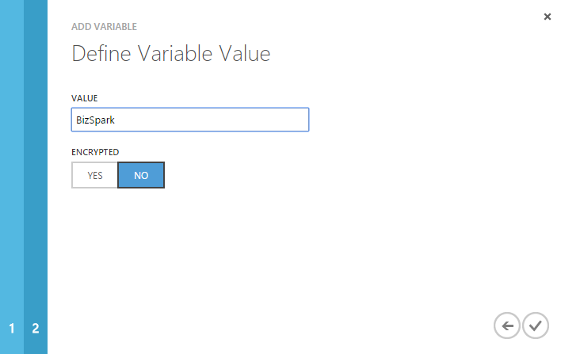 
	
1. Poté aplikujeme stejný postup a vytvoříme proměnnou **UserName**, do níž dáme jako hodnotu jméno, které jsme zadali v kroku *ADD CREDENTIAL* (v tomto případě tedy **Automation Admin**).

Nyní by mělo být vše potřebné připraveno a můžeme se pustit do vytváření skriptů.

## Nový runbook pro vypnutí VM
Skriptům se v Azure Automation říká _runbooky_ a jedná se o PowerShellová workflow. Je v nich přístup k modulu Azure a kdybychom si do ASSETS nahráli jakýkoliv jiný, tak můžeme jeho commandlety využívat rovněž.

1. Klikneme na tlačítko **NEW** vlevo dole a v Automation zvolíme **RUNBOOK**.

	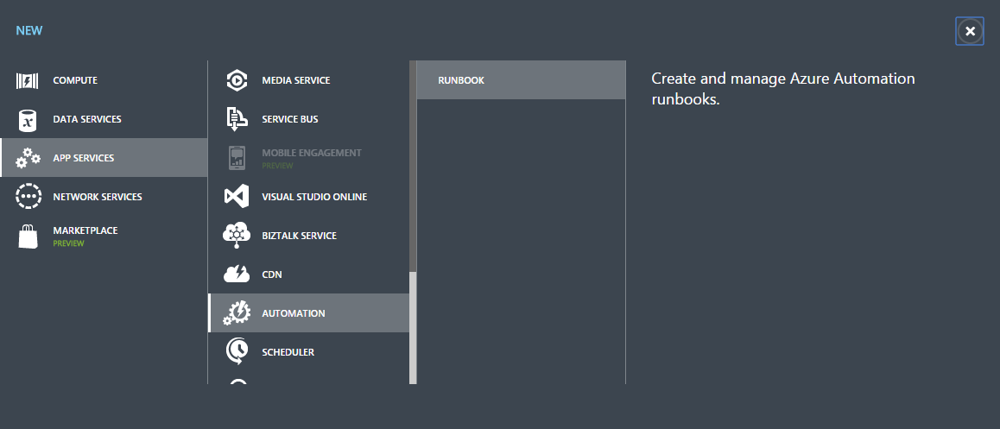
	
1. Jako název můžeme zadat třeba **shutdown**, zbytek necháme předvyplněný a potvrdíme **CREATE**.

	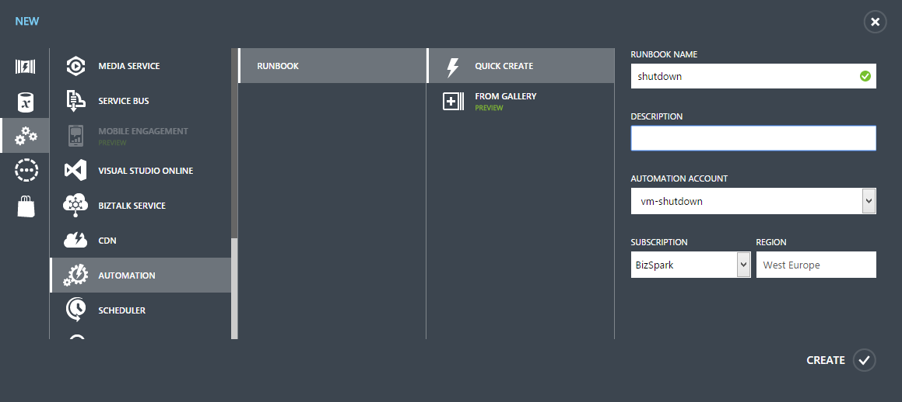

1. Otevřeme prázdný runbook a přejdeme rovnou na záložku **AUTHOR**.

	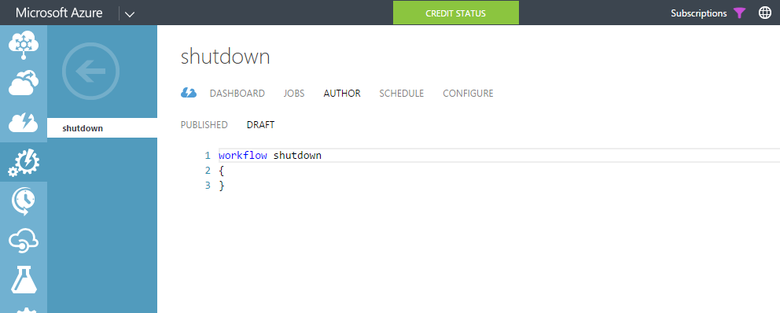
	
1. Nahradíme prázdný kód tímto:

	```powershell
	workflow Shutdown  
	{ 
	    Param (  
	        [parameter(Mandatory=$true)] 
	        [String] 
	        $VMName,   
	
	        [parameter(Mandatory=$true)] 
	        [String] 
	        $ServiceName 
	    )
	    
	    $subscriptionName = Get-AutomationVariable -Name "SubscriptionName" 
	    $userName = Get-AutomationVariable -Name "UserName"  
	
	    $cred = Get-AutomationPSCredential -Name $userName
	    Add-AzureAccount -Credential $cred
	
	    Select-AzureSubscription -SubscriptionName $subscriptionName 
	    Stop-AzureVM -Name $VMName -ServiceName $ServiceName -Force
	}
	```

1. Potom dole tlačítkem **TEST** ověříme, že funguje.

	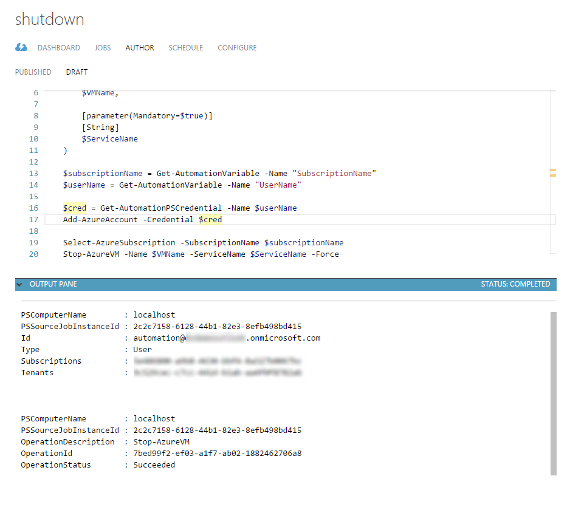
	
1. Pakliže je vše v pořádku, můžeme runbook publikovat - klikneme dole na tlačítko **PUBLISH** a potvrdíme.

V tuhle chvíli máme funkční skript, který se připojí k Azure a vypne virtuální stroj, který mu zadáme. Pořád jej však musíme spouštět ručně a opakovaně mu říkat, který stroj má vypnout. Automatizace přichází ve spojení se Schedulerem, který je na Automation úzce napojený.

1. Po vypublikování runbooku aktivujeme záložku **SCHEDULE** a klikneme na **LINK TO A NEW SCHEDULE**.

	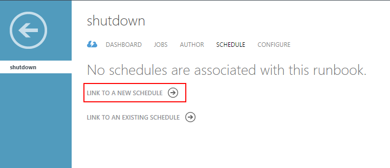
	
1. Název je opět libovolný a slouží hlavně k orientaci.

	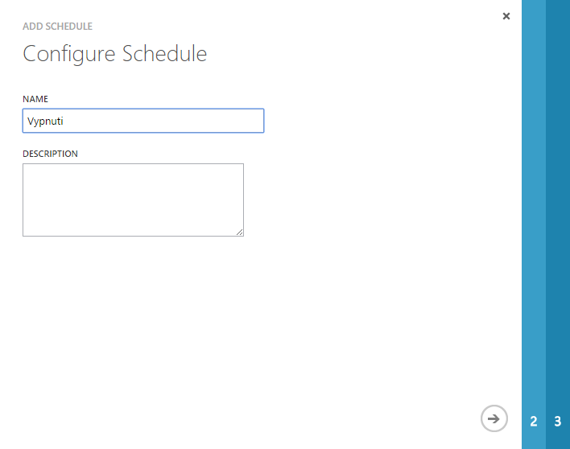
	
1. V části *Configure Schedule* nastavujeme, jak často se bude skript spouštět. V tomto případě tedy každý den v 11 hodin večer.

	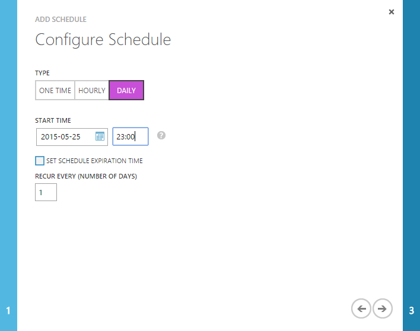
	
1. Další, neméně důležité nastavení jsou hodnoty vstupních parametrů. Služba Automation poznala, že runbook očekává na vstupu **název VM** a **název Cloud Service**, a proto je musíme nastavit ve třetím kroku. Často jsou obě hodnoty stejné, ale záleží na vašem konkrétním nastavení. V tomto případě se VM i Cloud Service jmenují stejně: *vm01*.

	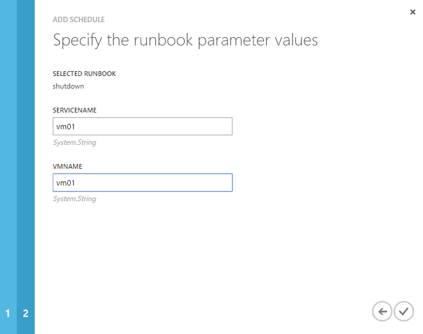
 
Hotovo! Virtuální stroj *vm01* v Cloud Service *vm01* se bude automaticky vypínat *každý den* ve *23:00*.

## Nový runbook pro zapnutí VM
Aby byl náš postup kompletní, měli bychom ještě vytvořit druhý runbook a schedule pro automatické zapnutí virtuálního stroje. Postup je totožný, liší se pouze ve dvou krocích:

* Runbook se bude jmenovat třeba **startup**.
* Na záložce **AUTHOR** bude tento kód:
	
	```powershell
	workflow Startup  
	{ 
	    Param (  
	        [parameter(Mandatory=$true)] 
	        [String] 
	        $VMName,   
	
	        [parameter(Mandatory=$true)] 
	        [String] 
	        $ServiceName 
	    )
	    
	    $subscriptionName = Get-AutomationVariable -Name "SubscriptionName" 
	    $userName = Get-AutomationVariable -Name "UserName"  
	
	    $cred = Get-AutomationPSCredential -Name $userName
	    Add-AzureAccount -Credential $cred
	
	    Select-AzureSubscription -SubscriptionName $subscriptionName 
	    Start-AzureVM -Name $VMName -ServiceName $ServiceName
	}
	```

(Změnil se název, změnilo se Stop-AzureVM na ```Start-AzureVM``` a zmizel parametr ```-Force```.)

## Na závěr
Pár poznámek na závěr:

* Každé Schedule je vlastně další zdroj umístěný v **ASSETS**, takže odtud ho můžete i deaktivovat.
* Automation si zatím neumí poradit s přechodem na zimní/letní čas. Je proto vhodné si vytvořit dvě sady časování - jednu pro zimní čas, druhou pro letní - a vždycky je k danému runbooku přelinkovat.
	