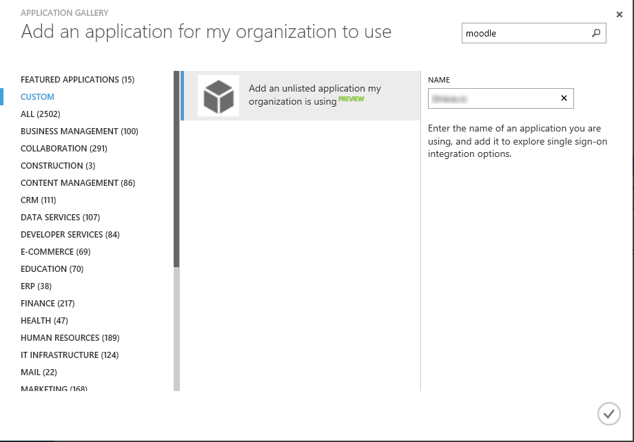

# Azure Active Directory Single Sign-On pomocí hesla

1. Na portále https://manage.windowsazure.com přejděte do sekce **ACTIVE DIRECTORY**.
1. Otevřete directory, v níž máte uživatele, kterým chcete umožnit přístup do aplikace.
1. Přejděte na záložku **APPLICATIONS** a dole klikněte na **ADD**.
1. V dialogu vyberte **Add an application from the gallery**.
	
	

1. Přejděte na **CUSTOM**, zvolte jedinou položku, která je v seznamu vpravo, a do políčka **NAME** napište název, který vám přiblíží, o jakou aplikaci jde (může být libovolný).

	
	
1. Aplikace se během několika vteřin vytvoří a otevře se obrazovka quick start.

	

1. Klikněte na **Configure single sign-on**.
1. V dialogu, který se otevře, vyberte **Password Single Sign-On**.

	
	
1. V dalším kroku zadejte adresu stránky, na níž je přihlašovací formulář (tedy pole pro zadání jména a hesla).

	
	
1. Azure se pokusí automaticky identifikovat pole, která slouží k přihlašování. Pokud se mu to nepodaří, vyzve vás k přihlášení ke stránce. Klikněte na zelené tlačítko **Click to sign in**.

	
	
1. Aby systém dokázal zachytit, která pole přihlašovacímu formuláři posíláte, potřebuje doinstalovat tzv. *Access Panel Extension*.

	
	
	1. Klikněte na **Install now** (nebo **Instalovat nyní**) a potvrďte spuštění instalátoru.

		
	
	1. Projděte instalací. Vyžádá si zavření všech oken IE.

		
	
	1. Jakmile bude instalace dokončena, otevře se okno prohlížeče, které vás instruuje k povolení doplňku. Klikněte na **Enable** (nebo **Povolit**).

		
	
	1. Když se nyní vrátíte do Azure Active Directory a projdete znovu do aplikace a do nastavení single sign-on, spustí se zachytávání metadat.

		
	
		
	
		
	
1. Nyní se přihlašte na stránku standardním způsobem. Azure to pozná a vrátí vás k průvodci. Tam zašrtněte **Sign in succeeded, check to continue**.

	
	
1. Dokončete průvodce.

	
	
1. Přejděte na záložku **USERS**. Uvidíte seznam uživatelů dané directory.
1. Vyberte uživatele, kterému chcete přiřadit přihlášení k dané aplikaci, a klikněte dole na tlačítko **ASSIGN**.

	
	
1. Dialog se zeptá, zda chcete přihlašovací údaje za uživatele zadat vy, nebo ho nechat, ať to udělá sám při prvním přihlášení.

	
	
1. Posledním krokem je vzít ze záložky **DASHBOARD** adresu **SINGLE SIGN-ON URL** a dát ji uživatelům (například ve formě odkazu na vlastním webu).

	
	
1. Uživatel použije svůj účet AAD, Azure jej přesměruje na přihlašovací stránku webu, vyplní za něj údaje a klikne na přihlašovací tlačítko.

## Troubleshooting, aneb když se něco nepovede

Může se stát, že systém bude neustále tvrdit, že doplněk *Access Panel Extension* není nainstalovaný. 

- V případě, že používáte režim *InPrivate*, musíte spouštění doplňků explicitně povolit, resp. odškrtnout políčko: `Možnosti internetu -> Osobní údaje -> Při spuštění funkce Procházení se službou InPrivate zakázat panely nástrojů a rozšíření`.
- Pokud to nepomůže, zabírá restartování celého počítače.
	
Pokud při pokusu o přihlášení zahlásí Azure Active Directory, že přihlašovací URL není pro danou stránku platná, zkontrolujte, že jste ve správné directory.

- Na stránce https://account.activedirectory.windowsazure.com/applications/ vpravo nahoře přepněte na správnou directory a obnovte seznam aplikací. Potom klikněte na danou aplikaci a budete přihlášeni.
- 
- 