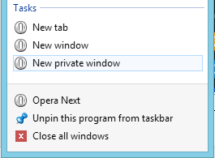
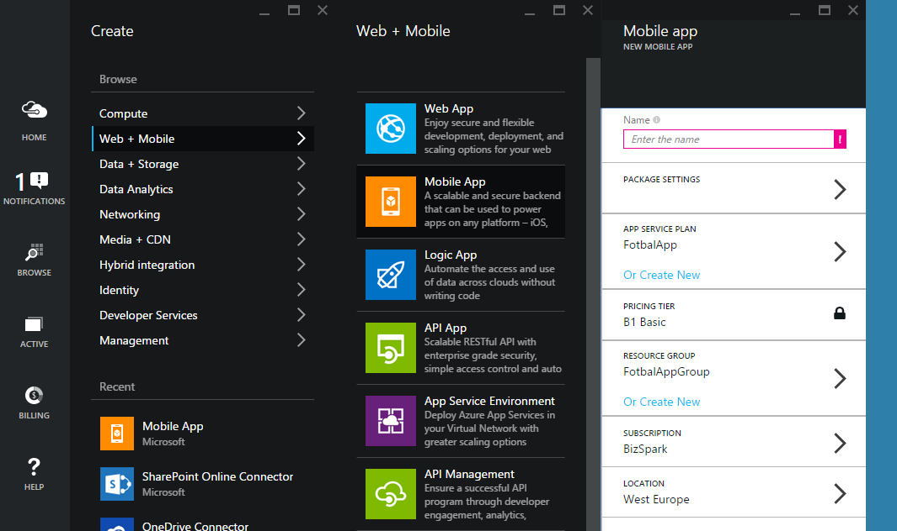
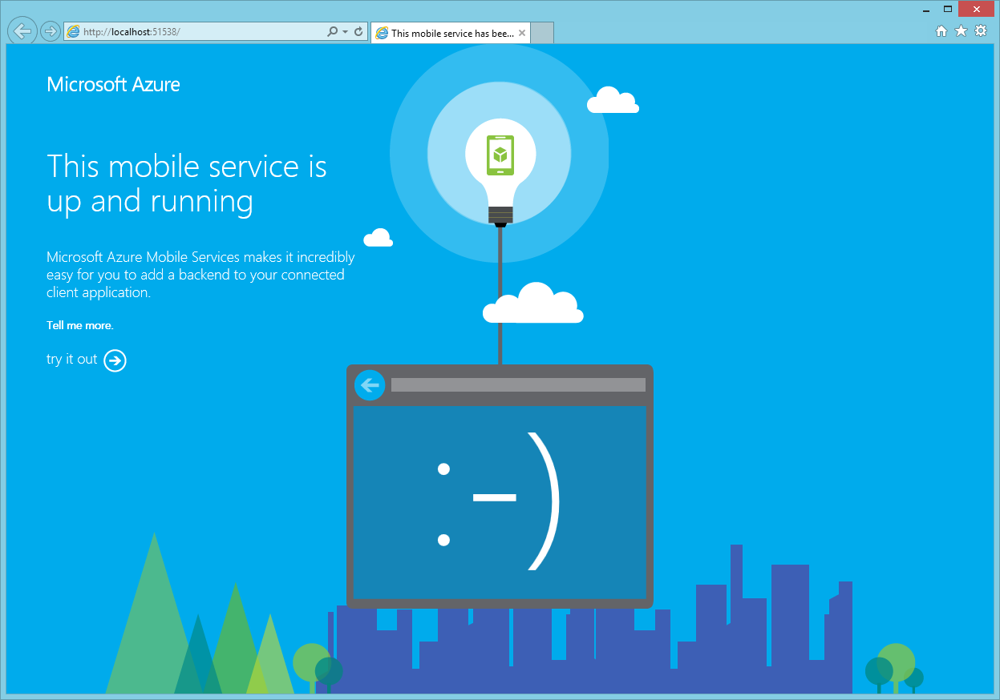

# Mobilní backend v Azure - Silicon Hill Demo
V tomto demu vytvoříme mobilní backend pomocí Azure Mobile App a přidáme mu autentizaci přes Twitter. Nakonec upravíme Windows Phone aplikaci tak, aby se s tím vyrovnala.

## Vytvoření Azure Mobile App
Přihlásíme se na **Preview** portál (https://portal.azure.com) pomocí Microsoft Account, ke kterému máme vytvořenou subskripci.
Pokud používáte víc účtů, je vhodné portál otevřít v anonymním režimu prohlížeče. Budete se sice muset pokaždé přihlašovat, ale zase se vyhnete konfliktům mezi účty.




Vytvořit novou Mobile App:


Je vhodné pro aplikaci vytvořit i vlastní Resource group a App Service Plan:


Jakmile se Mobile App vytvoří (trvá to pár minut), otevře se její Blade.

Podstatné pro nás je následující:
* **Essentials** - místo, kde jsou shruty základní informace a hlavně odkazy na důležité zdroje.
 * **Resource Group** – když se rozkline, můžeme vidět všechny související části aplikace.
 * **Gateway URL** – na gateway se nastavuje mimo jiné autentizace a je pak sdílená s dalšími součástmi.
 * **Mobile App Code** – web, na kterém je hostovaný kód backendu – jedná se o Web App.
 * **Notification Hub** – automaticky se na pozadí vytvořila infrastruktura pro posílání push notifikací.

Na pozadí nám tedy vznikla Web App pro hostování kódu, Notification Hub pro push notifikace a Gateway pro unifikovanou správu oprávnění.

## Aplikace - backend a klient
Bez dalších úprav můžeme kliknout na **Add Client**, vybrat **Windows (C#)** a potom **Download** u Server Projectu a **Download** u Windows Projectu.

Rozbalíme obě aplikace.

Nejprve **otevřeme serverový projekt („Runtime“)** – jedná se o nijak zvláštní ASP.NET MVC WebAPI aplikaci, která je obohacená o knihovny Mobile Services a dělá zatím jednoduchou činnost.

Než začneme projekt procházet, je potřeba postahovat NuGet balíčky. Right-click na projekt -> Manage NuGet Packages... -> **Restore**.


Aby nám potom zmizely červené vlnky, zbuildujeme projekt (**F6**).

Tato jednoduchá aplikace poskytuje seznam úkolů, které můžeme přidávat a označovat jako splněné. Základem je třída **TodoItem**, která představuje jednu položku. Zajímavé tady je, že dědí od *EntityData*. Ukázkový projekt totiž používá Entity Framework pro přístup k úložišti (v našem případě Azure SQL Database).
```csharp
using Microsoft.Azure.Mobile.Server;

namespace SiliconHillAppService.DataObjects
{
    public class TodoItem : EntityData
    {
        public string Text { get; set; }

        public bool Complete { get; set; }
    }
}
```

Vše podstatné se potom odehrává v **TodoItemController.cs**. Controller dědí od TableController, což je třída poskytnutá Azure Mobile Apps, která dodává abstrakci potřebnou pro CRUD operace.
```csharp
public class TodoItemController : TableController<TodoItem>
```
Následují operace API, které využívají metody poskytnuté předkem (Lookup, UpdateAsync atd.).

A nakonec nesmíme minout **Web.config**. Do něho byla automaticky doplněna konfigurace připojení k databázi, notifikačnímu hubu atd. Důležité tady je, že Connection Strings a App Settings jsou po publikování do Azure přepsány hodnotami na portále:

*Zpět do prohlížeče -> Essentials -> SiliconHillApp-code -> Settings -> Application settings*

My si ale můžeme backend otestovat i lokálně, prostě bez úprav zmáčkneme **F5**.



Automaticky se nám generuje i webové prostředí, kde si můžeme API vyzkoušet. Stačí kliknoutna **try it out** a pak vybrat některou z operací.


Druhá aplikace, mobilní, je v tomto případě Universal App pro Windows 8.1 a Windows Phone 8.1, takže sestává ze tří projektů – pro každou platformu jeden a společný Shared.


I v tomto případě bude potřeba obnovit NuGet balíčky a projekt přebuildovat (**Rebuild All**).

Aplikace vypadá hned po spuštění pro Windows Phone takto:


Nicméně po chvíli vyhodí chybu – znažíme se totiž připojit na webovou službu v Azure, kterou jsme ještě nepublikovali. Jak je to možné?

Odpoví nám pohled do **App.xaml.cs** (je potřeba ukončit Debug režim a přejít do projektu Shared).

```csharp
// This MobileServiceClient has been configured to communicate with the Azure Mobile Service and
// Azure Gateway using the application key. You're all set to start working with your Mobile Service!
public static MobileServiceClient MobileService = new MobileServiceClient(
    "https://siliconhillapp-code.azurewebsites.net",
    "https://siliconhilldemo5e486546asx546427b0067bc.azurewebsites.net",
    "MtANipHtoAOvt445aspWIFlKpPd65"
);
```
Vytváříme zde klienta pro mobilní službu, kterého budeme používat napříč aplikací. Je vidět, že mu zadáváme tři parametry: adresu samotné webové služby, adresu App Service gateway a klíč pro přístup.

Tyto údaje můžeme najít také na Azure portále:


Hned pod inicializací „ostrého“ klienta je pak možnost aktivovat lokální verzi. To teď zkoušet nebudeme a zkusíme raději vypublikovat službu do Azure a připojit se tam.

Klikneme pravým tlačítkem na webový projekt (**SiliconHillAppService**) a zvolíme **Publish**.


Azure SDK nám nabízí několik možností, my vybereme **Microsoft Azure Web Apps**.

A po přihlášení zvolíme naši webovou aplikaci (**SiliconHillApp-code**):


Po kliknutí na OK se stáhne publikační profil a předvyplní vše potřebné, takže nám stačí jenom zvolit **Publish**. První publikování bude chvilku trvat, protože se do Azure nahrávají všechny soubory aplikace, každé další už si pohlídá, že nahraje pouze změny.


Aplikace nyní funguje – služba je pro ni připravena.

# Přihlášení přes Twitter
## Serverová část
Pro přihlašování uživatelů nabízí Azure několik poskytovatelů: Microsoft Account, Facebook, Twitter, Google a Azure Active Directory. V tomto demu použijeme Twitter a nastavíme jak serverovou část, tak klientskou aplikaci.

1. Přejít na Twitter Developer portál: https://apps.twitter.com/.
1. Přihlásit se svým účtem.
1. Zvolit Create New App.

1. Vyplnit detaily:
 1. **Website** může být cokoliv.
 1. **Callback URL** je třeba zkopírovat z portálu (User Auth -> Twitter -> Callback URL). Je to adresa Gateway doplněná o „/signin-twitter“, takže vypadá nějak takhle: https://siliconhilldemo5e48685465418a327b0067bc.azurewebsites.net/signin-twitter.
 1. Potvrdit **Developer Agreement**.
*Pozn.: Abyste mohli vytvořit aplikaci, musíte mít u Twitter účtu zadáno číslo mobilního telefonu. Toto není omezení Azure, ale pravidlo nastavené Twitterem.*
1. Na záložce **Settings** je potřeba zkontrolovat, že políčko *„Allow this application to be used to Sign in with Twitter“* je zaškrtnuté.

1. Ze záložky **Keys and Access Tokens** si půjčíme dvě hodnoty: *Consumer Key (API Key)* a *Consumer Secret (API Secret)*.
*Pozn.: Oba tyto údaje by měly zůstat tajné. Chovejte se k nim jako ke jménu a heslu (což vlastně jsou).*
1. Obě hodnoty přeneseme do Azure portálu (User Auth -> Twitter -> **API Key** a **API Secret**).
1. Uložíme (**Save**).

Tím jsme dokončili konfiguraci na straně Azure. Mobilní platformy pak mají implementaci rozdílnou. Postupy najdete zde:
* iOS: http://azure.microsoft.com/en-us/documentation/articles/app-service-mobile-dotnet-backend-ios-get-started-users-preview/
* Xamarin.iOS: http://azure.microsoft.com/en-us/documentation/articles/app-service-mobile-dotnet-backend-xamarin-ios-get-started-users-preview/
* Xamarin.Android: http://azure.microsoft.com/en-us/documentation/articles/app-service-mobile-dotnet-backend-xamarin-android-get-started-users-preview/
* Windows Universal: http://azure.microsoft.com/en-us/documentation/articles/app-service-mobile-dotnet-backend-windows-store-dotnet-get-started-users-preview/

## Aplikační část
My se podíváme, jak přidat přihlášení přes Twitter do mobilní aplikace na Windows.

Otevřeme znovu webový projekt (**SiliconHillAppService**).

V backendu omezíme přístup pouze pro přihlášené uživatele. Protože se jedná o WebAPI, použijeme anotaci v Controlleru. Kdybychom chtěli omezit přístup jenom k některým metodám, můžeme je označit atributem místo controlleru.

V souboru **TodoItemController.cs**:

```csharp
[AuthorizeLevel(AuthorizationLevel.User)]
public class TodoItemController : TableController<TodoItem>
```

Kdybychom zkusili aplikaci teď ladit na lokálním počítači, zjistíme, že se nic nezměnilo. Mobile App lokálně tento atribut ignoruje. Změnit to můžeme jednoduše: na konec metody **Register** v souboru **WebApiConfig.cs** ve složce **App_Start** stačí přidat jeden řádek:

```csharp
config.SetIsHosted(true);
```

Nyní už bude i lokálně běžící služba vyžadovat přihlášení.

Publikujeme upravenou verzi backendu do Azure a zkusíme, jak se bude chovat mobilní aplikace.


V pořádku – služba vyžaduje přihlášení, my přihlášeni nejsme, tak vrací 401 Unauthorized.

Přidáme do **MainPage** následující kód:

```csharp
        // Define a member variable for storing the signed-in user. 
        private MobileServiceUser user;

        // Define a method that performs the authentication process
        // using a Facebook sign-in. 
        private async System.Threading.Tasks.Task AuthenticateAsync()
        {
            while (user == null)
            {
                string message;
                try
                {
                    user = await App.MobileService.LoginAsync(MobileServiceAuthenticationProvider.Twitter);
                    message =
                        string.Format("You are now signed in - {0}", user.UserId);
                }
                catch (InvalidOperationException)
                {
                    message = "You must log in. Login Required";
                }

                var dialog = new MessageDialog(message);
                dialog.Commands.Add(new UICommand("OK"));
                await dialog.ShowAsync();
            }
        }
```

Hodnotu **MobileServiceAuthenticationProvider** můžeme změnit, pokud bychom používali jiného poskytovatele přihlášení (třeba Facebook nebo Google).

V metodě **OnNavigatedTo** zakomentujeme řádek:

```csharp
await RefreshTodoItems();
```

Nechceme totiž volat službu před tím, než bude uživatel přihlášen. Samotnou autentizaci můžeme sputit až po skončení *OnNavigatedTo* a po vyvolání události *Loaded*. V rámci příkladu to provedeme v reakci na stisknutí tlačítka „Login“.

V souboru **MainPage.xaml** stačí do StackPanelu, který již hostí titulek aplikace vložit tlačítko:

```xml
<StackPanel x:Name="TitlePanel" Grid.Row="0" Margin="0,18,0,18">
    <TextBlock Text="SiliconHillApp" Style="{StaticResource TitleTextBlockStyle}" Margin="18,0"/>
    <Button x:Name="buttonLogin" Content="Login" Click="ButtonLogin_Click" Margin="10,0" />
</StackPanel>
```

A metoda ButtonLogin_Click bude vypadat takto:

```csharp
private async void ButtonLogin_Click(object sender, RoutedEventArgs e)
{
    await AuthenticateAsync();

    buttonLogin.Visibility = Windows.UI.Xaml.Visibility.Collapsed;
    await RefreshTodoItems();
}
```

Můžeme ji vložit do souboru **MainPage.cs** v projektu **Shared**, ale protože jsme tlačítko definovali jenom v jednom z projektů platforem (Windows Phone), bude *buttonLogin* červeně podtržený. Chybu můžeme opravit tím, že ho doplníme i do **MainPage.xaml** ve Windows projektu, nebo ji můžeme dočasně zamaskovat přepnutím platformy v rozbalovátku nad editorem. Při kompilaci se tímto ale chybě nevyhneme.


Na Windows Phone se aplikace deaktivuje, aby nabídla přihlašovací okno, je proto potřeba ošetřit návrat z autentizace. Do souboru **App.xaml.cs** v projektu **Shared** proto přidáme metodu OnActivated:

```csharp
        protected override void OnActivated(IActivatedEventArgs args)
        {
#if WINDOWS_PHONE_APP
            if (args.Kind == ActivationKind.WebAuthenticationBrokerContinuation)
            {
                App.MobileService.LoginComplete(args as WebAuthenticationBrokerContinuationEventArgs);
            }
#endif

            base.OnActivated(args);
        }
```       
 
Nyní jsme úspěšně přihlásili uživatele a dostali se k zabezpečeným datům. Není to řešení ideální, protože vyžaduje přihlášení při každém spuštění aplikace. Přihlašovací token můžeme uložit do lokální cache přímo na zařízení pomocí **PasswordVault**.
