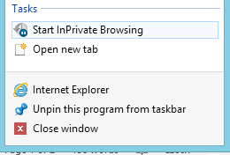

# Mobilní backend v Azure - Silicon Hill Demo
V tomto demu blabla...

## Vytvoření Azure Mobile App
Přihlásíme se na **Preview** portál (https://portal.azure.com) pomocí Microsoft Account, ke kterému máme vytvořenou subskripci.
Pokud používáte víc účtů, je vhodné portál otevřít v anonymním režimu prohlížeče. Budete se sice muset pokaždé přihlašovat, ale zase se vyhnete konfliktům mezi účty.



Vytvořit novou Mobile App:


Je vhodné pro aplikaci vytvořit i vlastní Resource group a App Service Plan:


Jakmile se Mobile App vytvoří (trvá to pár minut), otevře se její Blade.

Podstatné pro nás je následující:
* **Essentials** - místo, kde jsou shruty základní informace a hlavně odkazy na důležité zdroje.
 * **Resource Group** – když se rozkline, můžeme vidět všechny související části aplikace.
 * **Gateway URL** – na gateway se nastavuje mimo jiné autentizace a je pak sdílená s dalšími součástmi.
 * **Mobile App Code** – web, na kterém je hostovaný kód backendu – jedná se o Web App.
 * **Notification Hub** – automaticky se na pozadí vytvořila infrastruktura pro posílání push notifikací.

Na pozadí nám tedy vznikla Web App pro hostování kódu, Notification Hub pro push notifikace a Gateway pro unifikovanou správu oprávnění.

## Aplikace - backend a klient
Bez dalších úprav můžeme kliknout na **Add Client**, vybrat **Windows (C#)** a potom **Download** u Server Projectu a **Download** u Windows Projectu.

Rozbalíme obě aplikace.

Nejprve **otevřeme serverový projekt („Runtime“)** – jedná se o nijak zvláštní ASP.NET MVC WebAPI aplikaci, která je obohacená o knihovny Mobile Services a dělá zatím jednoduchou činnost.

Než začneme projekt procházet, je potřeba postahovat NuGet balíčky. Right-click na projekt -> Manage NuGet Packages... -> **Restore**.


Aby nám potom zmizely červené vlnky, zbuildujeme projekt (**F6**).

Tato jednoduchá aplikace poskytuje seznam úkolů, které můžeme přidávat a označovat jako splněné. Základem je třída **TodoItem**, která představuje jednu položku. Zajímavé tady je, že dědí od *EntityData*. Ukázkový projekt totiž používá Entity Framework pro přístup k úložišti (v našem případě Azure SQL Database).
```csharp
using Microsoft.Azure.Mobile.Server;

namespace SiliconHillAppService.DataObjects
{
    public class TodoItem : EntityData
    {
        public string Text { get; set; }

        public bool Complete { get; set; }
    }
}
```

Vše podstatné se potom odehrává v **TodoItemController.cs**. Controller dědí od TableController, což je třída poskytnutá Azure Mobile Apps, která dodává abstrakci potřebnou pro CRUD operace.
```csharp
public class TodoItemController : TableController<TodoItem>
```
Následují operace API, které využívají metody poskytnuté předkem (Lookup, UpdateAsync atd.).

A nakonec nesmíme minout **Web.config**. Do něho byla automaticky doplněna konfigurace připojení k databázi, notifikačnímu hubu atd. Důležité tady je, že Connection Strings a App Settings jsou po publikování do Azure přepsány hodnotami na portále:

*Zpět do prohlížeče -> Essentials -> SiliconHillApp-code -> Settings -> Application settings*

My si ale můžeme backend otestovat i lokálně, prostě bez úprav zmáčkneme **F5**.


